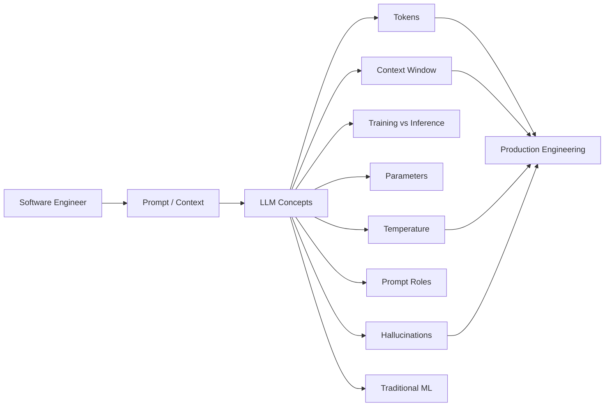
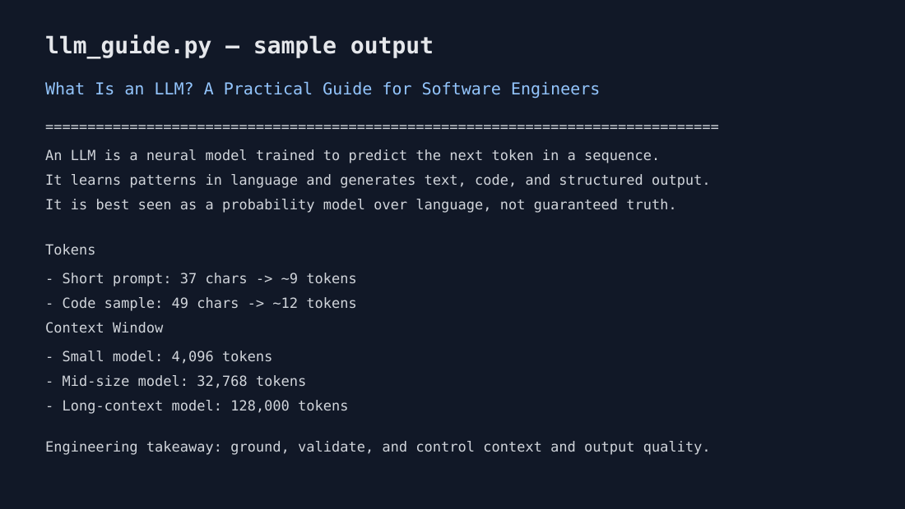

# What Is an LLM? A Practical Guide for Software Engineers

This project is a compact, practical guide for understanding large language models (LLMs) from a software engineering perspective. It explains the core concepts you will see in interviews, architecture reviews, and AI product design discussions.

## What is an LLM?

A large language model is a neural network trained on massive text datasets to predict the next token given previous text. In simple terms, it learns statistical patterns in language and uses those patterns to generate coherent text, answer questions, summarize documents, write code, and more.

Important practical perspective:

- It is not a database and not a traditional rule engine.
- It is a probability model over text.
- It is trained to imitate patterns in large corpora of human writing and code.
- It becomes useful when you give it instructions, examples, and context.

Example:

- Input: "Write a Python function to parse a CSV file."
- Model output: a generated function that matches likely patterns in training data.

This is why LLMs are strong at language tasks, code generation, summarization, and reasoning-like tasks, but still unreliable in precise or high-stakes domains without careful validation.

## Tokens

A token is the unit of text the model processes. It may be a word, part of a word, punctuation, or a subword piece.

Examples:

- "hello" -> often one token
- "unbelievable" -> may be several tokens
- "return 42;" -> may be tokenized into pieces and punctuation

Why tokens matter:

- LLMs consume and generate text in token units, not plain characters.
- Token count affects cost, latency, and model limits.
- Prompt length, examples, and output length all count against the model's token budget.

Rule of thumb:

- 1 token is roughly 4 characters of English text.
- 100 tokens is roughly 75 words.
- This is an approximation, not a guarantee.

## Context window

The context window is the maximum number of tokens the model can consider at one time.

This includes:

- system instructions
- conversation history
- retrieved documents
- examples in a prompt
- generated output

If you exceed the context window, the model may truncate or ignore older content or fail entirely.

Example context windows:

- Small models: 4k-8k tokens
- Mid-tier models: 32k-128k tokens
- Large long-context models: 1M+ tokens

Practical engineering lesson:

- Keep prompts compact and content-relevant.
- Use retrieval-augmented generation (RAG) to inject only necessary documents.
- Summarize long histories if needed.

## Training vs inference

### Training

Training is the expensive phase where the model learns from vast datasets.

The model updates its parameters to reduce prediction error.

Characteristics:

- Requires huge compute
- Done offline in data centers
- Expensive and slow
- Usually done once per model version or periodically

### Inference

Inference is the act of using the trained model to generate output for a prompt.

Characteristics:

- Happens when a user asks a question or sends a request
- Runs on CPU/GPU infrastructure
- Cost and latency matter in production
- Can be optimized with batching, caching, and quantization

In practice:

- Training creates the intelligence
- Inference applies it to real workloads

## Parameters

Parameters are the learned weights inside the model.

Think of them as the internal knobs that capture patterns in training data. More parameters usually means a larger model that can represent more complex patterns.

Examples:

- 7B model = 7 billion parameters
- 70B model = 70 billion parameters

Higher parameter count often correlates with stronger generalization, but not always. The quality also depends on:

- dataset quality
- training procedure
- architecture
- alignment tuning
- inference settings

## Temperature

Temperature is a sampling setting that controls how creative or deterministic the output is.

Lower temperature values (for example 0.1 to 0.4):

- more precise
- safer
- more repetitive
- useful for classification, extraction, structured output

Higher temperature values (for example 0.8 to 1.5):

- more diverse
- more creative
- more likely to hallucinate or drift off-topic
- useful for brainstorming and writing

Example:

- Temperature 0.0: nearly deterministic output
- Temperature 1.0: more variation

Production advice:

- Use lower temperature for code generation, extraction, and summarization.
- Use slightly higher temperature for ideation and creative tasks.

## Prompt

A prompt is the input you provide to a model.

It can include:

- instructions
- examples
- documents
- constraints
- output format requirements

Good prompts are usually specific, structured, and clear.

Example prompt:

```text
You are a senior backend engineer.
Return JSON with fields: summary, risks, and next_steps.
Use only the information in the attached document.
If uncertain, say "unknown" instead of guessing.
```

Prompt engineering is not magic; it is a disciplined way to shape model behavior through instructions and examples.

## System vs user messages

Modern chat models often use role-based messages:

- System message: sets the overall behavior and identity of the assistant
- User message: asks the question or provides the task

Example:

```text
System: You are a helpful engineering assistant. Be concise, factual, and cite uncertainty.
User: Summarize the causes of service latency in this deployment report.
```

Why system messages matter:

- They act like global operating instructions
- They are excellent for tone, policy, safety, and formatting
- They help keep responses consistent across tasks

User messages carry the actual task and can include documents, goals, and constraints.

## Why LLMs sometimes hallucinate

Hallucination means the model produces confident but false or unsupported information.

Common reasons:

- The model is predicting probable text, not verifying facts
- It may infer patterns from incomplete or noisy training data
- It can be forced to answer even when it lacks enough evidence
- It may follow the structure of a plausible answer rather than the truth

Practical mitigation strategies:

- Ask for citations or evidence
- Ground responses with retrieval from trusted sources
- Use structured output schemas
- Validate answers with rules, tools, or human review
- Reduce temperature in high-precision tasks
- Ask the model to say "unknown" when confidence is low

Important engineering point: an LLM is best seen as a language generator with some reasoning ability, not as a truth oracle.

## LLM vs traditional ML

Traditional machine learning usually focuses on narrow tasks:

- predict a label
- detect anomalies
- classify images
- forecast demand
- rank results

Typical characteristics:

- smaller, task-specific datasets
- explicit target labels
- clear evaluation metrics
- specialized model pipelines
- less flexibility across tasks

LLMs are different:

- trained on massive general text corpora
- can perform many tasks with one model
- adaptable through prompting and fine-tuning
- strong at generative language tasks
- less predictable in precise factual use cases

A practical software engineering comparison:

- Traditional ML: optimized for specific, measurable, repeatable tasks
- LLMs: flexible interfaces over language and knowledge, better for interaction and synthesis

In real systems, you often combine both:

- LLM for conversational interfaces and summarization
- rules and ML models for classification, validation, and enforcement
- vector databases or retrieval systems for grounding
- monitoring and guardrails in production

## Practical engineering checklist

When building with LLMs, review:

- Prompt design and system instructions
- Context length and token budgeting
- Retrieval scope and grounding quality
- Temperature choice
- Output schema enforcement
- Evaluation and testing strategy
- Human approval for high-risk actions
- Cost and latency monitoring

## Suggested usage patterns

- Use chat models for assistants, copilots, and natural language interfaces
- Use embeddings + vector search for knowledge retrieval
- Use structured generation for forms, JSON payloads, and domain extraction
- Use tool calling to access external systems safely
- Use moderation and validation layers for production safety

## Summary

An LLM is a large probabilistic model trained to predict the next token in sequence. It is powerful because it learns patterns from vast data, but it is not a guarantee of truth. The software engineering challenge is not just using the model, but designing prompts, budgets, retrieval, evaluation loops, and safety checks around it.

That is what turns a capable model into a practical, reliable product.

## Project files

This repository includes a small Python script that demonstrates the key ideas in a simple, code-first way.

Run:

```bash
python llm_guide.py
```

This script prints a practical summary of:

- what an LLM is
- token estimation
- prompt structure
- context window examples
- temperature guidance
- comparisons with traditional ML


## Architecture

The project is intentionally dependency-free so the concepts can be explored without an API key or model provider.



## Sample output

The repository includes a visual representation of the script's sample console output:



## Automated testing

GitHub Actions runs the Python test suite on pushes to `main` and on pull requests.


## Blog

The companion article is being developed for the **Vikram Tech Lab** technical blog. A public blog URL will be added here when the site is published.

## Author

**Vikram Singh** — Senior Java / Cloud / AI Engineer

This project is part of a practical learning series covering LLMs, AWS, Kubernetes, GenAI, AI agents, and production engineering.
